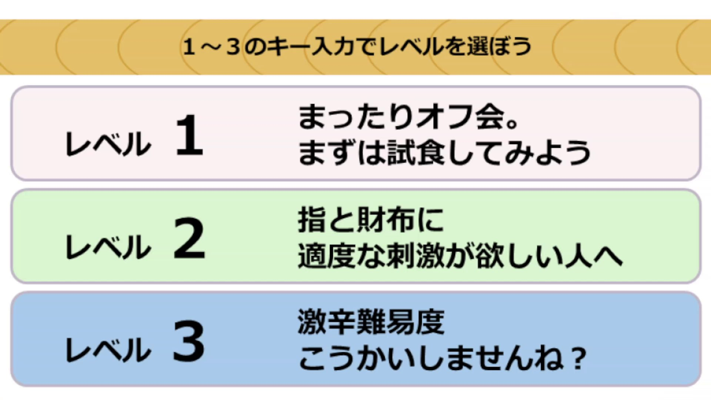
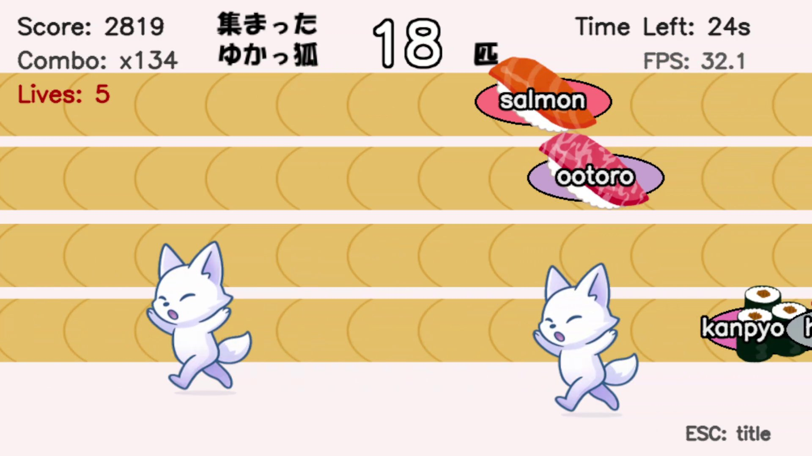
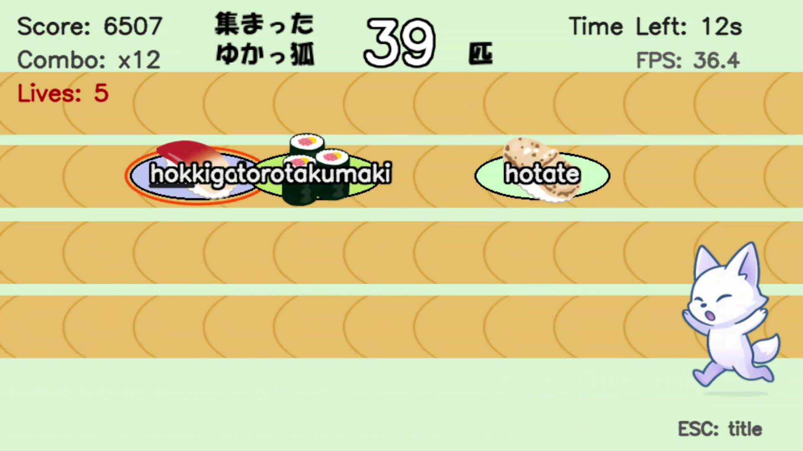

# お寿司だよ！ゆかっ狐集合

<table>
<tr><td></td><td></td></tr>
<tr><td></td><td></td></tr>
</table>

# 概要
このゲームは先日デビューした新人YouTuber・[神楽月ゆか（ゆかち）](https://www.youtube.com/@KagurazukiYuka)のファンゲームです。  
声が特徴的でどの配信も面白いので是非遊びに行って下さい！  
みんなでゆかっ狐になりましょう
- [YouTubeリンク](https://www.youtube.com/@KagurazukiYuka)
- [X（旧Twitter）](https://x.com/KagurazukiYuka)
- [マシュマロ](https://marshmallow-qa.com/sufxrwoh7z8ic2n)

# ダウンロード
- [こちらからWindows版をダウンロードして遊んでください](https://github.com/yukachi-game/yukachi-sushi/releases/download/v251010/yukachi_sushi_game.zip)
- みんなでお寿司オフ会をしましょう

# 遊び方
**このゲームはキーボードだけで遊べます**
- 起動画面では適当なキーを入力して下さい
- 難易度選択画面では，「1」or「2」or「3」のキーを入力して難易度を選択して下さい
- するとゲームスタート！お寿司の名前をタイプしてください！

**時間内に出来るだけたくさんのゆかっ狐とお寿司を食べよう！**

# その他
このゲームはPythonで書かれています．MacやLinux等PythonがあればWindows以外でも遊べます  
**遊び方**
```bash
$ git clone https://github.com/yukachi-game/yukachi-sushi.git
$ cd yukachi-sushi/yukachi_sushi
$ python game.py
```
※ライブラリのインストールが必要な場合があります

# ライセンス
このゲームでは下記の画像素材を使用しています
- [いらすとや](https://www.irasutoya.com/)
- [illustAC](https://www.ac-illust.com/main/detail.php?id=2414999)
- [ChatGPTによる生成画像](https://chatgpt.com/)